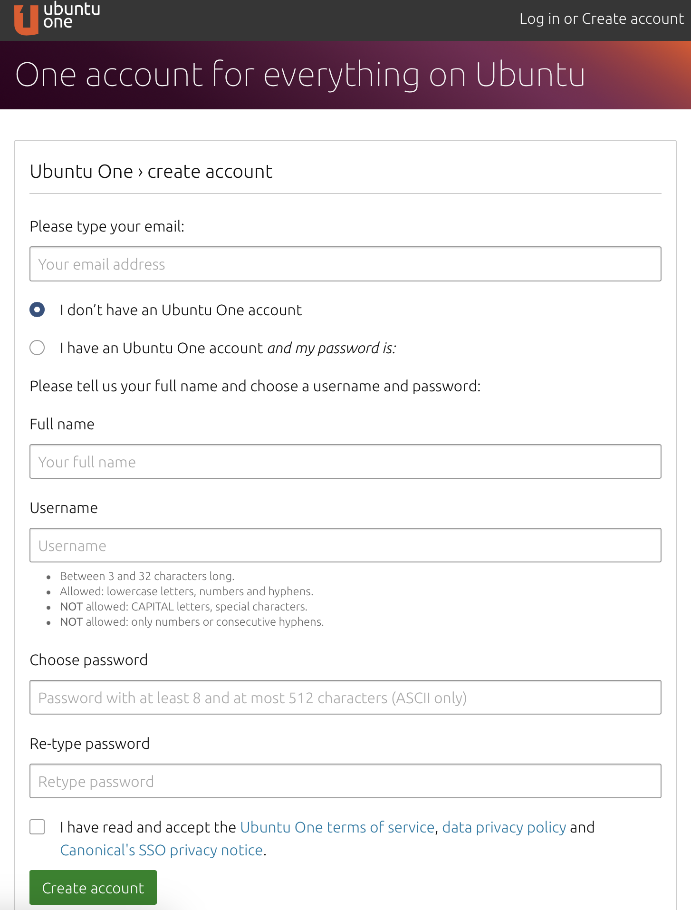

# 02. launchpad 가입하기

1. https://launchpad.net/ 에 접속합니다.

2. Log in / Register 를 클릭하여 회원가입을 진행합니다.
   (launchpad ID가 있으면 8번으로 넘어가 주세요.)

3. I don’t have an Ubuntu One account 체크 박스를 선택합니다.

4. 텍스트 박스에 full name, username, password 를 입력합니다.

5. I have read and accept the Ubuntu One terms of service, data privacy policy and Canonical's SSO privacy notice. 체크 박스를 선택합니다.

6. Create account 버튼을 눌러 가입을 완료합니다.

7. 기입한 이메일로 발송된 본인 확인 메일을 열어 인증합니다.

8. launchpad에 로그인합니다.

[다음](03_create_GPG_key.md) 챕터로
넘어갑시다!
