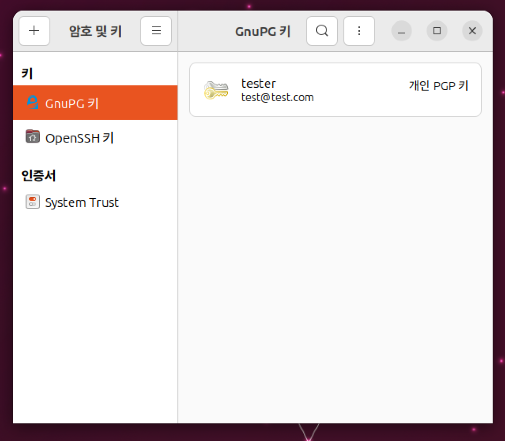
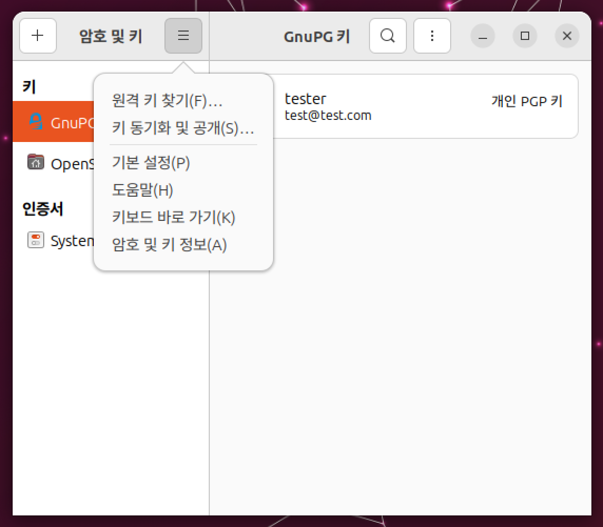
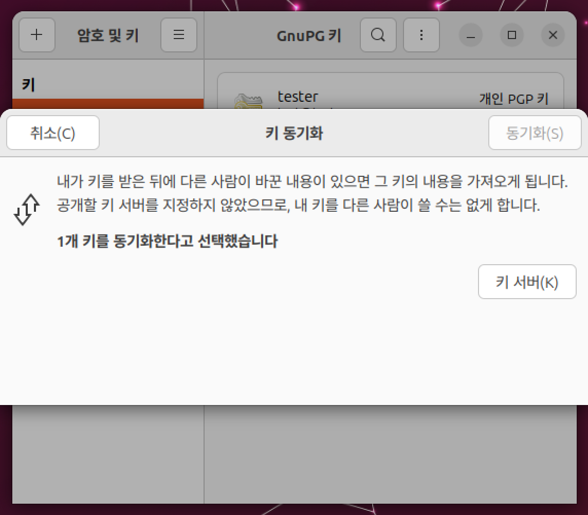
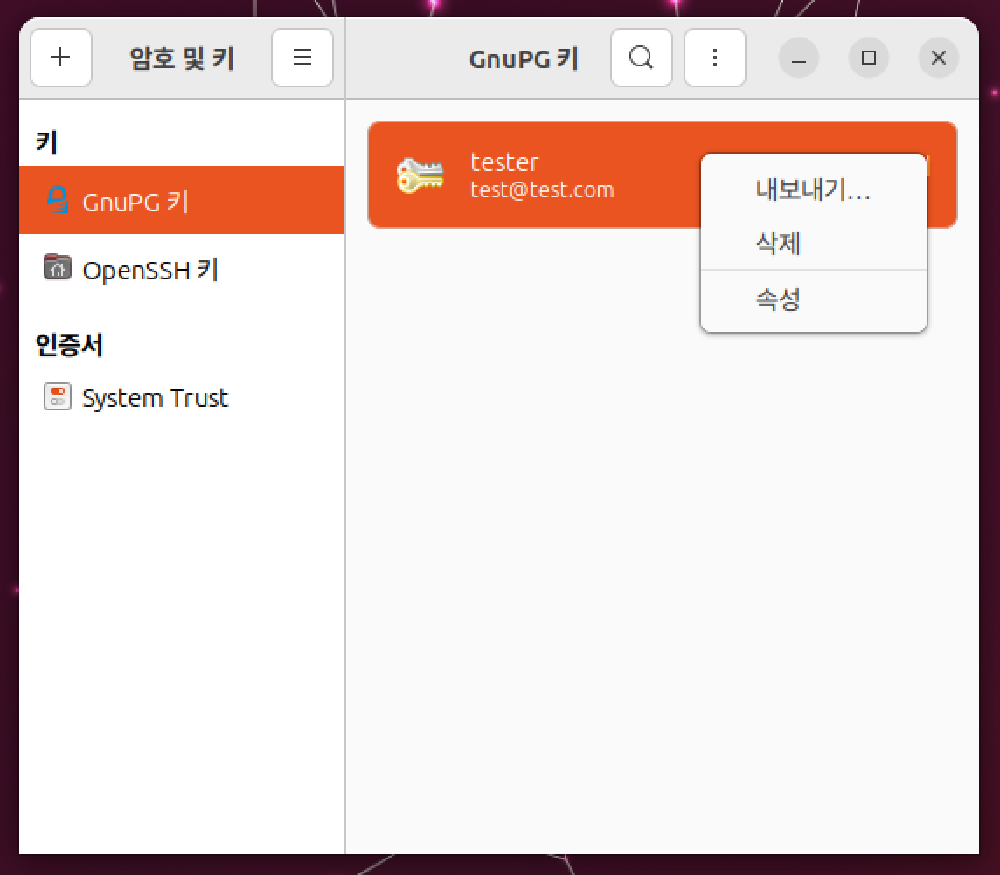
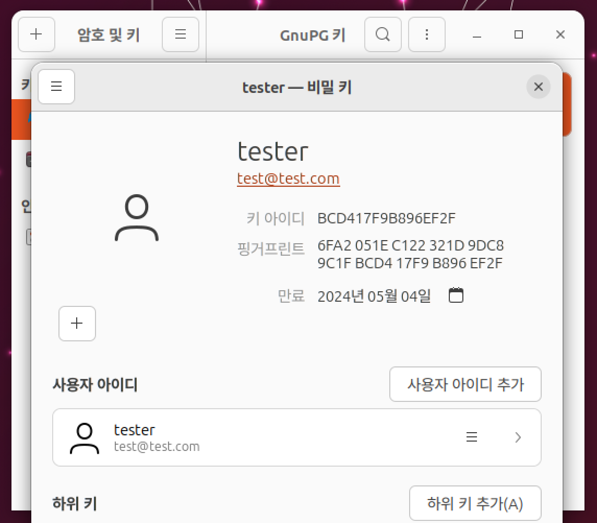

# 03. GPG 만들기

바로가기 : [CLI로 키 만들기](#cli) / 바로가기 : [GUI로 키 만들기](#gui)

반드시 GUI, CLI 둘 중 하나의 과정만 실습합니다.

## GUI

### 1) GPG키를 만들어 봅시다.

1) 프로그램 → 보조프로그램 → 암호 및 키를 클릭하거나, 터미널로 ```seahorse &``` 프로그램 실행합니다.


2) 새 항목 추가 - PGP 키 매뉴를 선택합니다.


3) 전체 이름, 이메일을 입력합니다.
만약 만료 기간을 정하려면 아래 "만료되지 않음"을 체크 해제하고 만료 날짜 지정합니다.


모두 완료해면 만들기 버튼이 활성화됩니다.

4) 잠시 기다립니다.



### 2) 우분투 서버에 키를 동기화 해봅시다.

1) 원격매뉴에서 키 동기화 및 공개 매뉴를 선택합니다.



2) 키 서버를 누릅니다.



3) 키를 공개할 곳에서 hkp://keyserver.ubuntu.com:11371를 입력하거나 선택합니다.


4) 서버 선택을 완료하면 아래와 같이 동기화 버튼이 활성화됩니다.


5) 동기화하고 기다립니다.

### 3) 개인키를 백업해봅시다.

1) 내 폴더에서 숨김 파일을 보이게 설정하고 Home 폴더에서 .gnupg 폴더를 찾습니다.


2) 해당 폴더를 백업합니다.



3) 혹은 암호 및 암호화 키 프로그램에서 내보내기로 asc파일으로 백업합니다.

### 4) 핑거프린트를 확인해봅시다.


1) 암호 및 키 프로그램에서 본인의 키를 우측 클릭하여 속성에 들어갑니다.



2) 핑거프린트를 확인합니다.

## CLI

### 1) GPG키를 만들어 봅시다.

1) gpg --gen-key 를 터미널에 입력합니다.

```shell
gpg --gen-key
```

2) 기본값을 선택하기위해 enter를 누릅니다.

3) 최종확인 질문이 나오면 y를 입력합니다. (틀리면 n)

4) gpg키의 이름,메일주소를 작성합니다.

5)입력한 정보가 맞다면 o를 눌러 확인합니다

6)비밀번호를 만들어 줍니다.

7) 랜덤 바이트를 모아줍니다.

* 참조 [스택오버플로우](https://stackoverflow.com/questions/11708334/pgp-asymmetric-not-enough-random-bytes-available-please-do-some-other-work-to)

8) gpg2 --list-key 명령어로 자신의 키 id를 확인합니다.

```shell
gpg2 --list-key 
```

### 2) 우분투 서버에 키를 동기화 해봅시다.

1) gpg --send-keys --keyserver keyserver.ubuntu.com {키ID} 를 터미널에 입력합니다.

```shell
gpg --send-keys --keyserver keyserver.ubuntu.com {키ID}
```

2) 동기화하고 기다립니다.

### 3) 개인키를 백업해봅시다.

1) 내 폴더에서 숨김 파일을 보이게 설정하고 Home 폴더에서 .gnupg 폴더를 찾습니다.


2) 해당 폴더를 백업합니다.


3) 혹은 암호 및 암호화 키 프로그램에서 내보내기로 asc파일으로 백업합니다.

### 4) 핑거프린트를 확인해봅시다.

1) gpg --fingerprint를 터미널에 입력하여 현재 가지고 있는 키의 핑거프린트를 확인합니다.

```shell
gpg --fingerprint
```

[다음](04.code-of-conduct%EC%84%9C%EB%AA%85%ED%95%98%EA%B8%B0.md) 챕터로 넘어갑시다!
