# 03. GPG 만들기

바로가기 : [CLI로 키 만들기](#cli) / 바로가기 : [GUI로 키 만들기](#gui)

반드시 GUI, CLI 둘 중 하나의 과정만 실습합니다.

## GUI

### GPG키를 만들어 봅시다.

1) 암호 및 키 어플리케이션을 클릭하거나, 터미널로 ```seahorse &``` 명령어를 실행합니다.

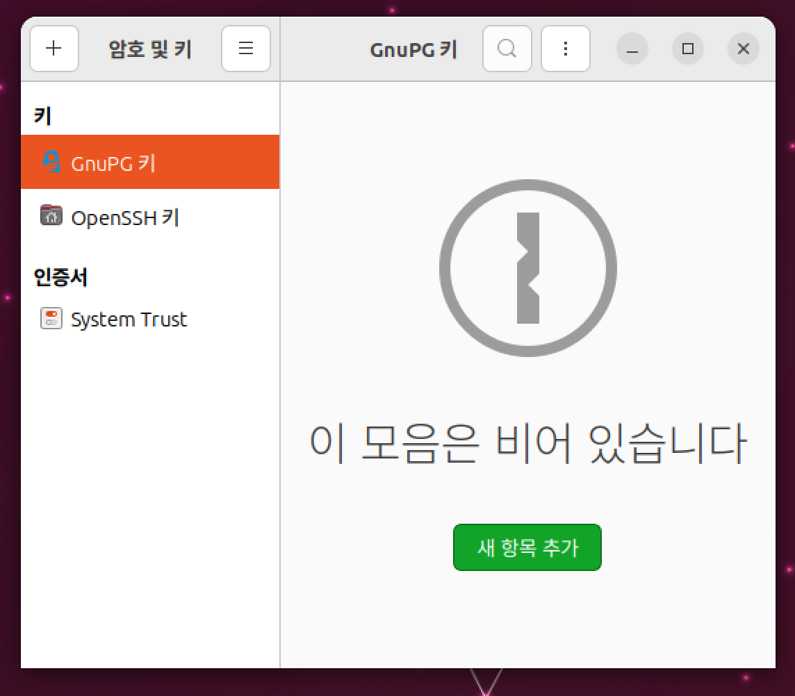

2) 새 항목 추가 버튼을 눌러서 PGP 키 항목을 선택합니다.

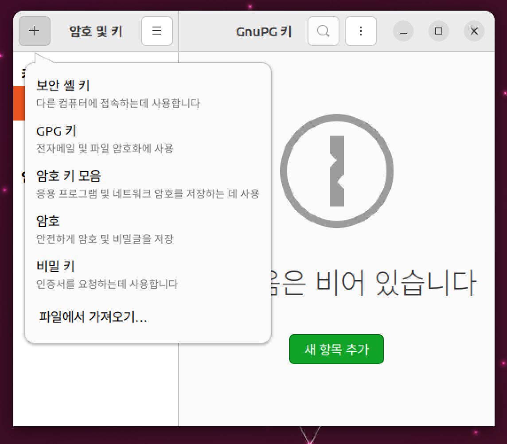

3) 전체 이름, 이메일을 입력합니다.
만약 만료 기간을 정하려면 아래 "만료되지 않음"을 체크 해제하고 만료 날짜 지정합니다.

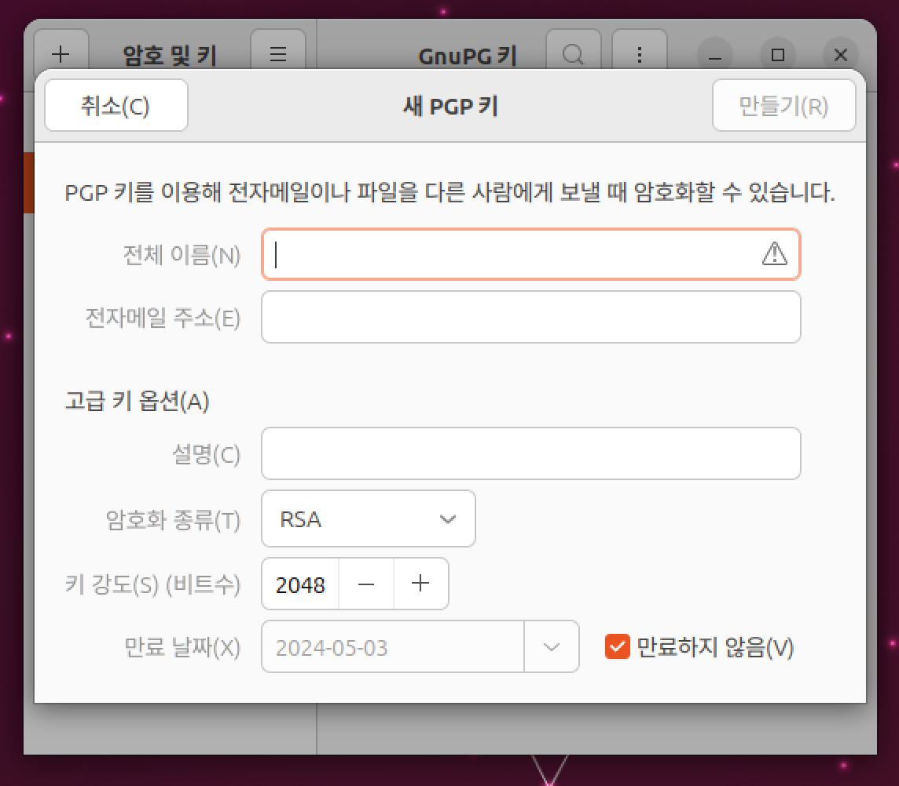
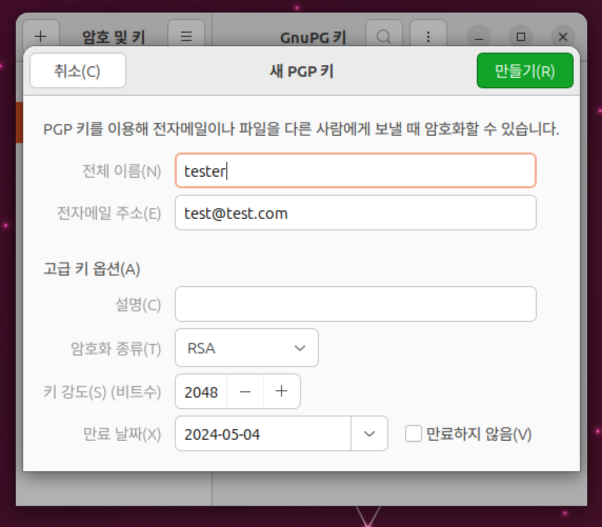

모두 완료하면 만들기 버튼이 활성화됩니다.

4) 잠시 기다립니다.

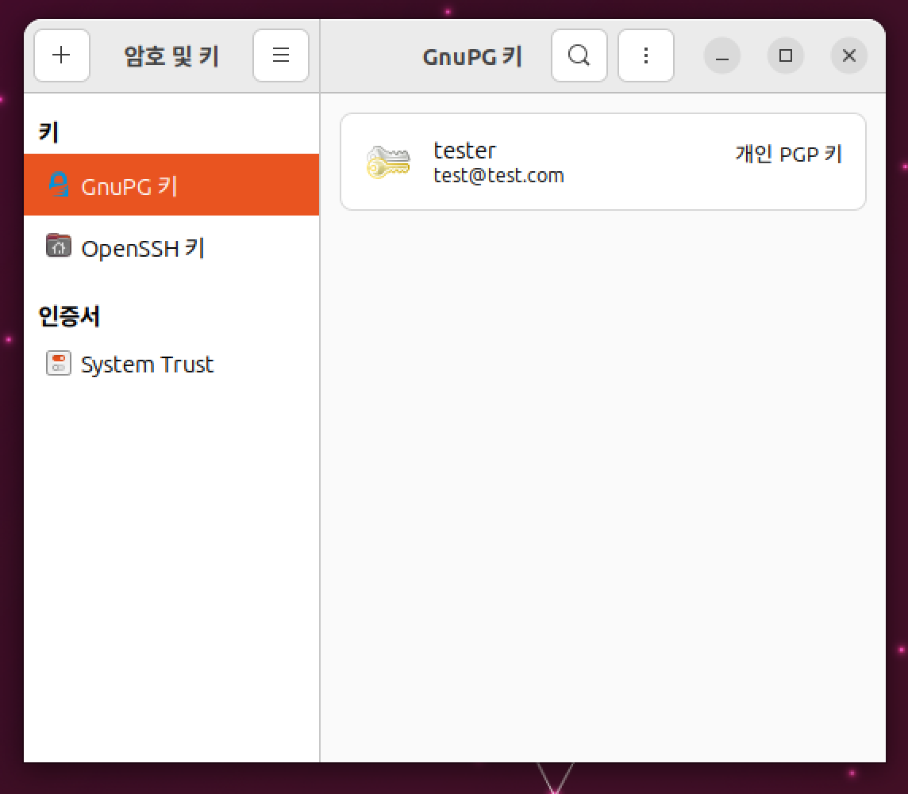

### 우분투 서버에 키를 동기화 해봅시다.

1) 원격 매뉴에서 키 동기화 및 공개를 선택합니다.


2) 키 서버 버튼을 누릅니다.

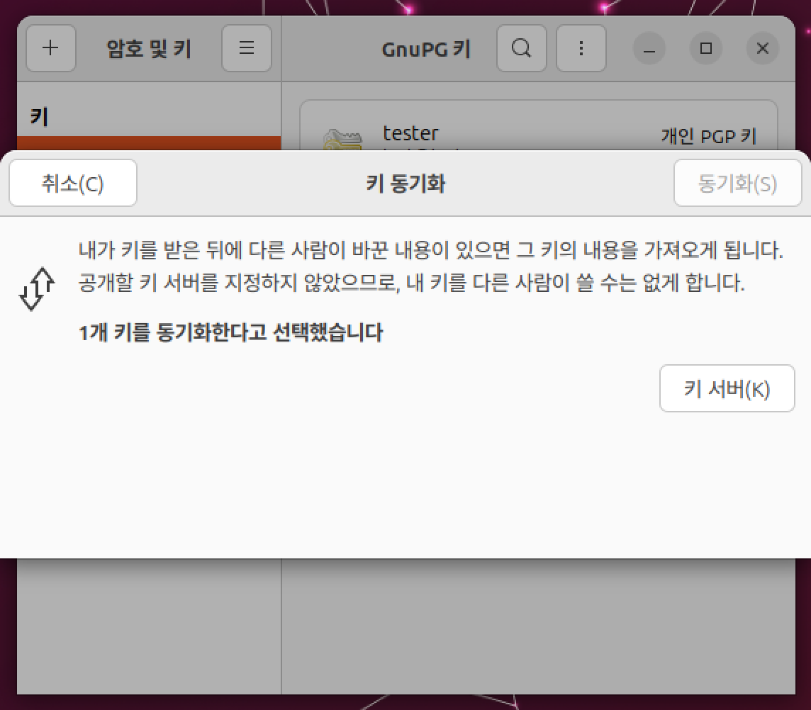

3) 키를 공개할 곳에서 hkp://keyserver.ubuntu.com:11371 주소를 입력하거나 선택합니다.

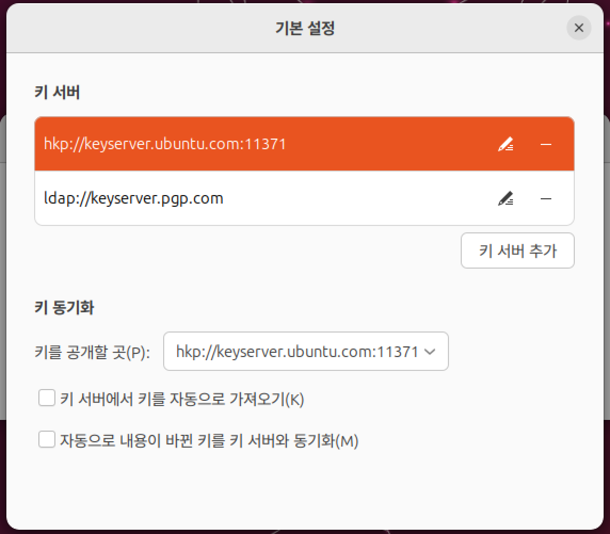

4) 서버 선택을 완료하면 아래와 같이 동기화 버튼이 활성화됩니다.

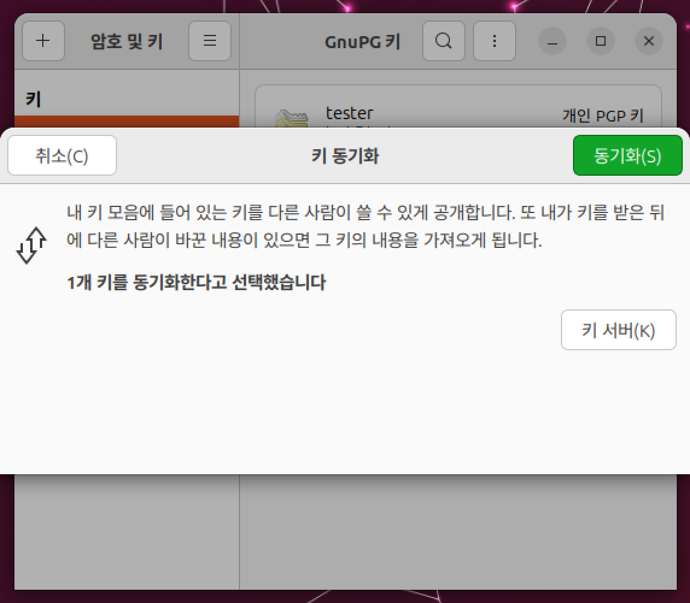

5) 동기화하고 기다립니다.

### 개인키를 백업해봅시다.

1) 내 폴더에서 숨김 파일을 보이게 설정하고 .gnupg 디렉토리를 찾습니다.

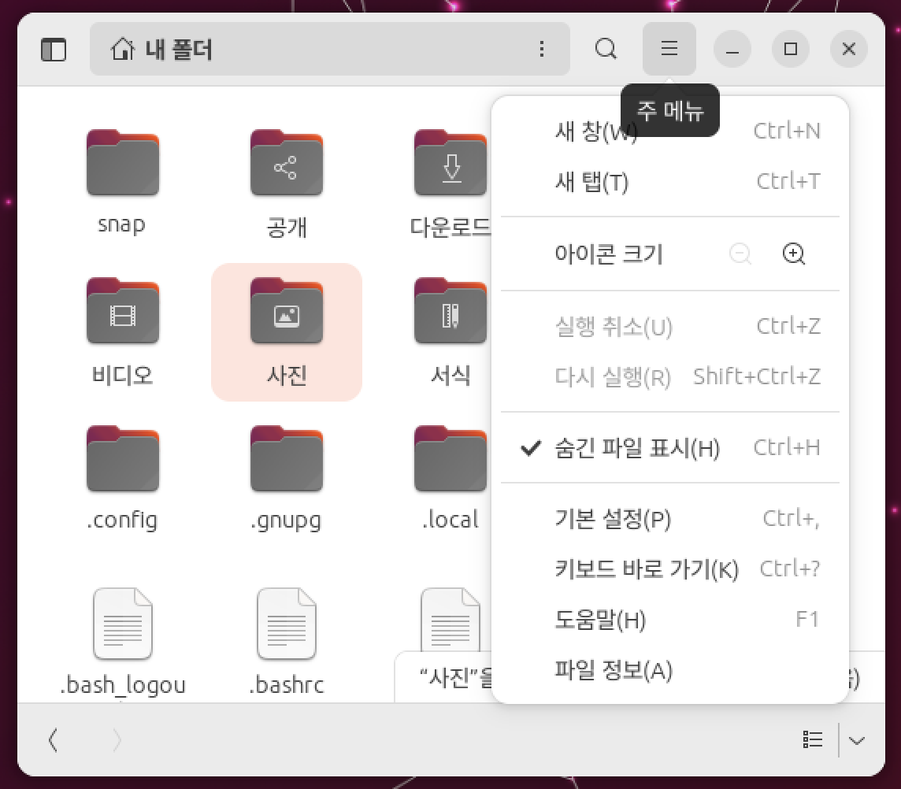

2) 해당 폴더를 백업합니다.

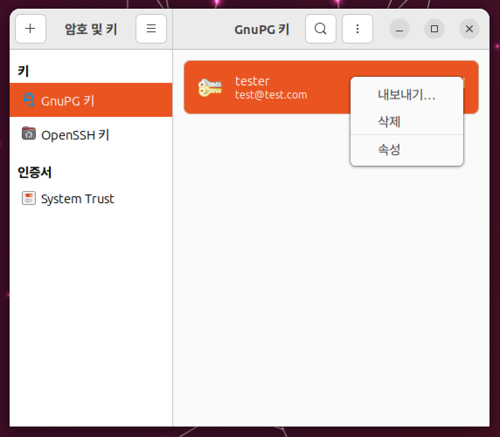

3) 혹은 암호 및 암호화 키 프로그램에서 내보내기를 사용해서 asc 파일으로 백업합니다.

### 핑거프린트를 확인해봅시다.


1) 암호 및 키 프로그램에서 본인의 키를 우측 클릭하여 속성에 들어갑니다.

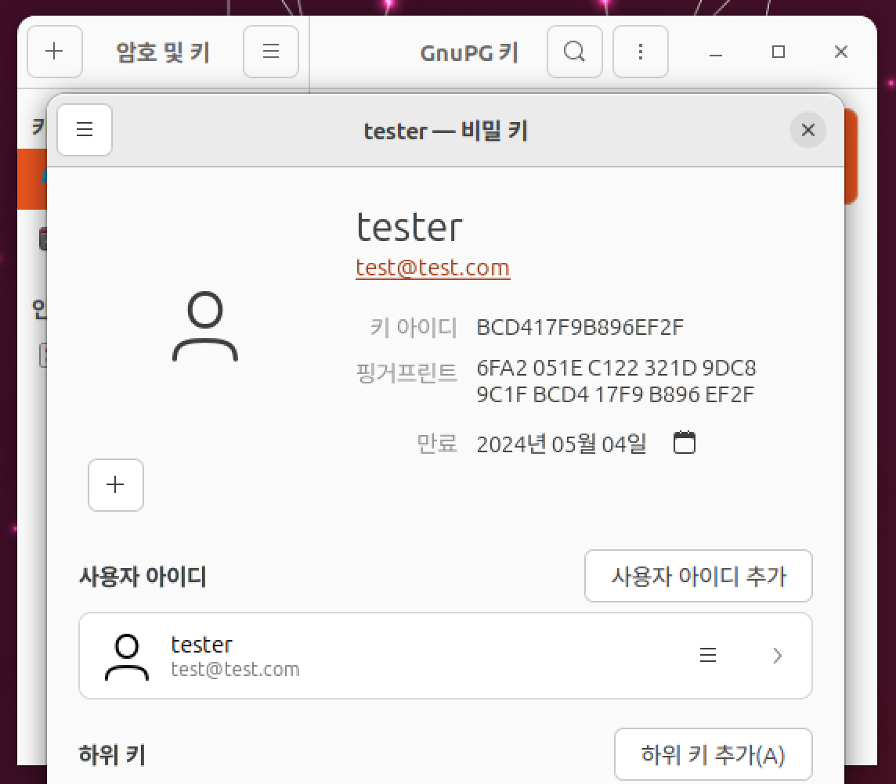

2) 핑거프린트를 확인합니다.

## CLI

### GPG키를 만들어 봅시다.

1) 아래 명령어로 키를 생성해볼 수 있습니다.

```shell
gpg --full-generate-key
```

```text
vm@VirtualBox:~$ gpg --full-generate-key
gpg (GnuPG) 2.2.40; Copyright (C) 2022 g10 Code GmbH
This is free software: you are free to change and redistribute it.
There is NO WARRANTY, to the extent permitted by law.

Please select what kind of key you want:
   (1) RSA and RSA (default)
   (2) DSA and Elgamal
   (3) DSA (sign only)
   (4) RSA (sign only)
  (14) Existing key from card
Your selection? 
```

```text
RSA keys may be between 1024 and 4096 bits long.
What keysize do you want? (3072) 
```

2) 기본 값을 선택하기위해 enter를 누릅니다.

```text
Please specify how long the key should be valid.
         0 = key does not expire
      <n>  = key expires in n days
      <n>w = key expires in n weeks
      <n>m = key expires in n months
      <n>y = key expires in n years
Key is valid for? (0) 
```

3) 만료 시기를 지정하려면 숫자를 입력하거나 만료 시기를 정하지 않고 싶다면 기본값 0으로 둡니다.

다음과 같이 1 (1 일), 1w (1 주), 1m (1 달), 1y (1 년) 을 입력할 수 있습니다.

4) 만료 기간을 지정하면 만료되는 시점을 알려주고, 맞는지 확인합니다. (맞으면 y 입력)

5) gpg키의 이름, 이메일을 작성합니다.

```text
GnuPG needs to construct a user ID to identify your key.

Real name: tester
Email address: test@test.com
Comment: 
You selected this USER-ID:
    "tester <test@test.com>"

Change (N)ame, (C)omment, (E)mail or (O)kay/(Q)uit? 
```

6) 입력한 정보가 맞다면 o를 눌러 확인합니다

7) 비밀번호를 만들어 줍니다.

8) 아래 안내가 나오면 랜덤 바이트를 모아줍니다.

```text
We need to generate a lot of random bytes. It is a good idea to perform
some other action (type on the keyboard, move the mouse, utilize the
disks) during the prime generation; this gives the random number
generator a better chance to gain enough entropy.
```

* 참조 [스택오버플로우](https://stackoverflow.com/questions/11708334/pgp-asymmetric-not-enough-random-bytes-available-please-do-some-other-work-to)

9) 공개키와 비밀키가 생성되었으므로 gpg --list-key 명령어로 자신의 키 id를 확인합니다.

```shell
gpg --list-key 
```

```text
vm@VirtualBox:~$ gpg --list-key
gpg: checking the trustdb
gpg: marginals needed: 3  completes needed: 1  trust model: pgp
gpg: depth: 0  valid:   2  signed:   0  trust: 0-, 0q, 0n, 0m, 0f, 2u
gpg: next trustdb check due at 2023-05-05
/home/vm/.gnupg/pubring.kbx
```

### 우분투 서버에 키를 동기화 해봅시다.

1) 아래 명령어를 사용해서 자신의 공개키를 keyserver.ubuntu.com 키 서버로 올립니다.

```shell
gpg --send-keys --keyserver keyserver.ubuntu.com {키ID}
```

2) 동기화하고 기다립니다.

### 우분투 서버의 저장된 키를 확인합니다.
1) 아래 명령어를 사용해서 자신의 공개키와 keyserver.ubuntu.com의 키와 비교 확인합니다.

```shell
gpg --keyserver hkp://keyserver.ubuntu.com --search-key {e-mail}
```

### 개인키를 백업해봅시다.

1) 내 폴더에서 숨김 파일을 보이게 설정하고 .gnupg 디렉토리를 찾습니다.


2) 해당 폴더를 백업합니다.


3) 혹은 암호 및 암호화 키 프로그램에서 내보내기를 사용해서 asc 파일으로 백업합니다.

### 핑거프린트를 확인해봅시다.

1) 아래 명령어를 터미널에 입력하여 현재 가지고 있는 키의 핑거프린트를 확인합니다.

```shell
gpg --fingerprint
```

[code of conduct 서명](04_signing_code-of-conduct.md) 챕터로 넘어갑시다!
