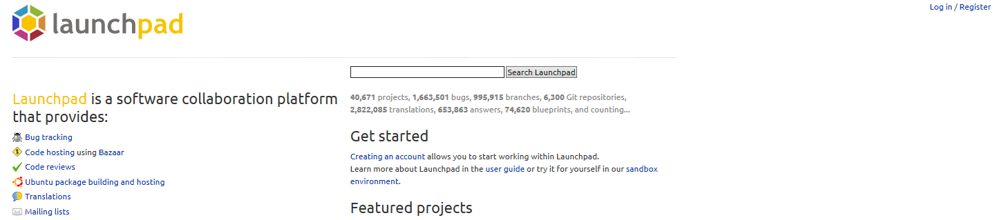
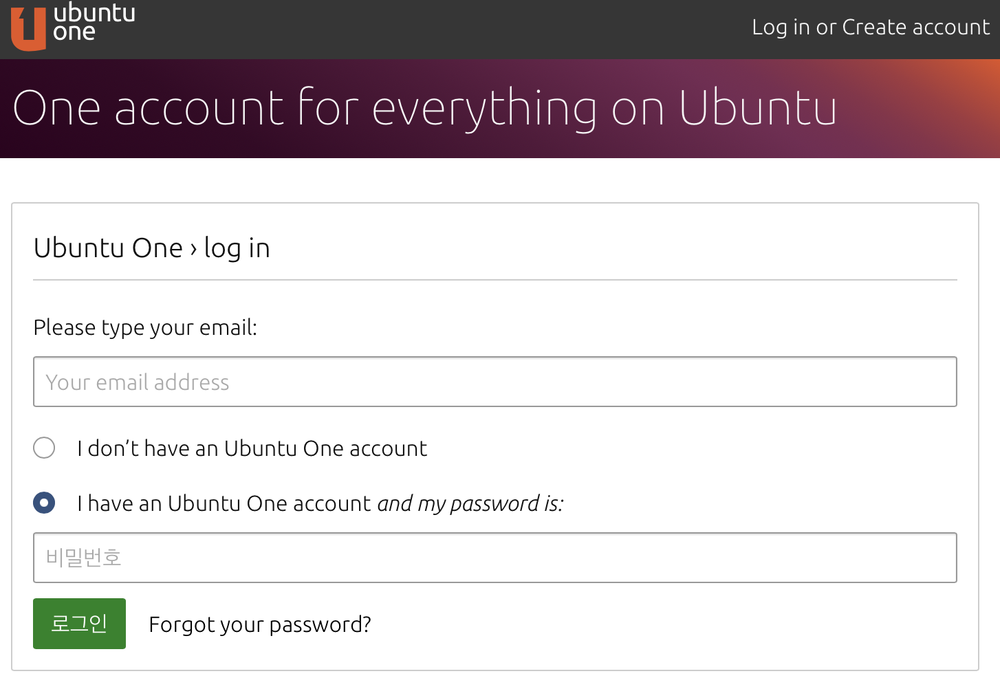

# 04. code of conduct 서명하기

### 1) GPG키를 launchpad에 등록해봅시다.

*만약 이미 프로필을 만드신분은 6번으로 넘어가주세요.*



1) 챕터02에서 만든 launchpad ID를 이용하여 I have an Ubuntu One account and my password is 클릭하고 로그인합니다.



```text
You are logging in to https://launchpad.net/

Launchpad has requested some personal information, please choose what you would like to share:
```

2) Personal Data Request에서 이름과 이메일 주소를 확인한뒤 yes, log me in 을 누릅니다.

3) 상단의 로그아웃 좌측에 있는 본인 닉네임을 클릭합니다.

4) 프로필 화면의 우측에 있는 Change details, Change branding로 자신만의 프로필을 만듭니다.

5) Languages와 Time zone도 설정해줍니다.

6) OpenPGP keys의 우측에 있는 연필 모양을 클릭합니다.

7) 다시 재 로그인합니다.

8) Change your OpenPGP keys에 진입했으면, Fingerprint 칸에 만들었던 키의 핑거프린트를 복사 & 붙여넣기합니다.

9) 하단의 Import key를 누릅니다.

10)  개인 이메일에 접속하여, 수신한 메일에서 하단의 PGP MESSAGE 부분을 복사합니다. (만약 자동으로 암호화 해제해주는 이메일 클라이언트를 사용하신다면 14번으로 넘어가주세요.)

11) 복사한 본문을 새로운 파일에 붙여넣기하고 저장합니다.

12) gpg --decrypt {파일 이름} 을 터미널에 입력합니다.

13) 챕터03에서 설정한 비밀번호를 요구하면 입력해줍니다.

14) 출력되는 인증 링크를 들어갑니다.

15) Continue를 눌러 인증을 마무리합니다.

16) 이제 code of conduct를 서명하러 넘어갑시다.

### 2) code of conduct에 서명해봅시다.

1) Signed Ubuntu Code of Conduct: 에 No라고 되었는 링크를 클릭합니다.

2) [Download](https://launchpad.net/codeofconduct/2.0/+download)를 눌러 최신 code of conduct 본문을 내려받습니다. (혹은 https://launchpad.net/codeofconduct/2.0/+download 을 이용해도됩니다.)

3) gpg --clearsign UbuntuCodeofConduct-2.0.txt를 터미널에 입력합니다.

4) 생성된 asc파일의 내용을 launchpad의 Signed code에 붙여넣습니다.

5) Continue를 클릭합니다.

6) 우분투 행동 강령에 서명했습니다.

```text
Ubuntu Codes of Conduct
The current version is 2.0, released 2005-04-12

Congratulations, you have already signed the Ubuntu Code of Conduct.
```


[다음](05.%ED%8C%80%EA%B0%80%EC%9E%85%ED%95%98%EA%B8%B0.md) 챕터로 넘어갑시다!
