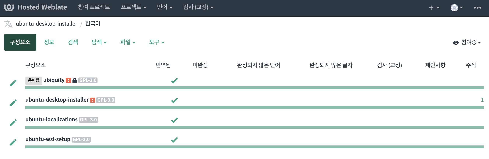
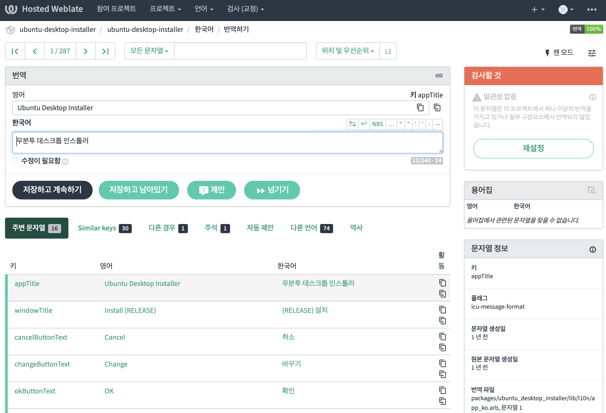

# 07. weblate 번역

최근 ubuntu-desktop-installer 번역이 weblate 플랫폼을 사용하고 있습니다.
그래서 weblate 플랫폼으로 ubuntu-desktop-installer 패키지를 번역해보는 실습을 진행해보겠습니다.

* ubuntu-desktop-installer: Ubuntu Desktop Installer 주요 번역 구성 요소

* ubuntu-localizations: 다른 프로젝트와 공유되는 일반적인 번역 및 언어 이름

* ubiquity: Ubiquity 가져온 읽기 전용 용어집

참고: weblate는 GitHub 프로젝트와 연동되어서 매일 변경 사항을 푸시하고 GitHub에 PR을 엽니다.

github : https://github.com/canonical/ubuntu-desktop-installer

weblate : https://hosted.weblate.org/languages/ko/ubuntu-desktop-installer/

1. weblate ubuntu-desktop-installer 프로젝트 화면에서 우측 상단 가입&로그인 
   * github 커밋 연동을 위해 동일한 이메일 추천
   * 1 장에서 생성한 Ubuntu One 계정 사용 추천
2. 아래 패키지 번역을 위해서 페이지 접근 후 번역하기 클릭

https://hosted.weblate.org/projects/ubuntu-desktop-installer/ubuntu-desktop-installer/ko/
